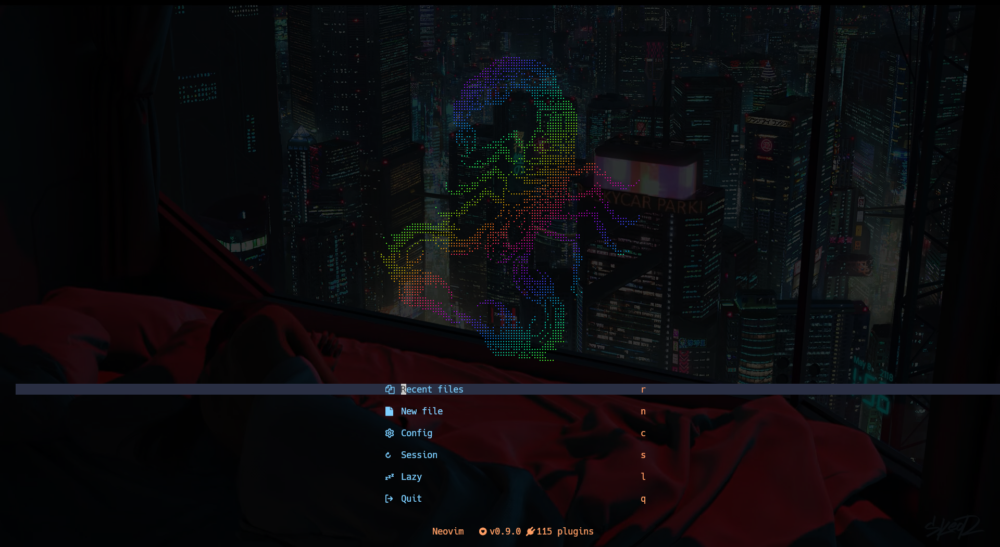

<style>
.markdown-body code {
  font-family: Hack Nerd Font;
  font-size: 14px;
}
</style>


# Neovim 配置简述

<!--toc:start-->
- [Neovim 配置简述](#neovim-配置简述)
  - [推荐几个教程](#推荐几个教程)
<!--toc:end-->


依赖在`../install.sh`的必装部分，此目录下`./install.sh`会安装主要的依赖项。

插件配置在`nvim/lua/plugins`目录下，使用[ lazy ](https://github.com/folke/lazy.nvim)插件管理器安装。

- `./coc-config` :[ coc ](https://github.com/neoclide/coc.nvim)未使用，但保留其配置。
- `./colors` :配置 neovim 透明,用`colorscheme`使用，例如在配置[ tokyonight ](https://github.com/folke/tokyonight.nvim)后加载,使得背景透明。
- `./dashboard` :是[ dashboard.nvim ](https://github.com/glepnir/dashboard-nvim)的`preview file`。
- `./ftplugin` :neovim 会根据文件类型加载其中文件,`文件类型`+`.lua/vim`后缀,会先加载.vim，后加载.lua。
- `./lua/dap-conf` :是对各个语言`Debug Adapter`的配置。
- `./lua/lsp` :是对各个`lsp`的`setting`部分的配置,返回一个`setting`部分的`table`,nvim-lspconfig 会加载其中`.lua`后缀的文件。
- `./lua/plugins` :是对各个插件的配置。
- `./plugin` :nvim 会自动加载其中`.vim/lua`文件。
- `./vim-config` :对 vim 相关的配置。
- `./viml` :vim 和 neovim 的共用配置。
- `./cheatsheets.txt` :[ vim 操作速查 ](https://github.com/skywind3000/awesome-cheatsheets/blob/master/editors/vim.txt)。
- `./tasks.ini` :插件[ asynctasks ](https://github.com/skywind3000/asynctasks.vim)的配置

```
 ./
├──  coc-config/
├──  colors/
├──  dashboard/
│  ├──  pictures/
│  └──  the_cat/
├──  ftplugin/
├──  lua/
│  ├──  dap-conf/
│  ├──  lsp/
│  └──  plugins/
│     ├──  cmps/
│     ├──  daps/
│     ├──  database/
│     ├──  garish/
│     ├──  lsps/
│     ├──  masons/
│     ├──  navigation/
│     ├──  previews/
│     ├──  run_code/
│     ├──  telescopes/
│     ├──  translators/
│     ├──  ui/
│     └──  utils/
├──  pictures/
├──  plugin/
├──  spell/
├──  vim-config/
│  └──  vim-lsp/
└──  viml/
└──  template/
```

## 推荐几个教程

- [ Vim 从入门到精通 ](https://github.com/wsdjeg/vim-galore-zh_cn)
- [ 在 neovim 中使用 lua ](https://github.com/glepnir/nvim-lua-guide-zh)
- [ 中文速查表 ](https://github.com/skywind3000/awesome-cheatsheets)
- [ 菜鸟教程 ](https://www.runoob.com/lua/lua-tutorial.html)
