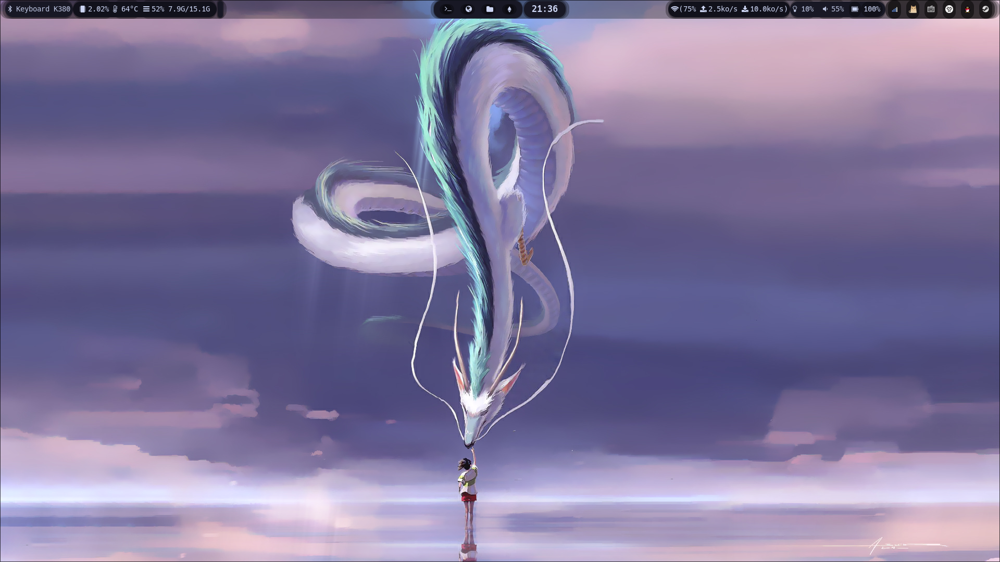

# 个人应用配置



<!--toc:start-->
- [个人应用配置](#个人应用配置)
  - [先运行](#先运行)
  - [如果要使用本配置，执行下面代码，包含 `ranger` 的插件](#如果要使用本配置执行下面代码包含-ranger-的插件)
    - [也可以执行](#也可以执行)
  - [Clone 完成后](#clone-完成后)
  - [Nvidia，自行选择是否安装，最好看 archwiki](#nvidia自行选择是否安装最好看-archwiki)
  - [zsh](#zsh)
- [License](#license)
<!--toc:end-->

除去 arch 安装脚本部分。
高度个性化，谨慎使用。

`./linkConfig.sh` 会尝试取代现有配置，运行时会提示，回车为不取代，输入 **yes** 才尝试取代。

## 先运行

```bash
# 后跟 clash 订阅链接，而且链接要加双引号，不然有可能下载失败
$ ~/.linuxConfig/scripts/configClash.sh
```

[yacd](http://yacd.metacubex.one) 可以管理 clash,
端口为配置文件里面 [external-controller](http://127.0.0.1:19090)  的端口

## 如果要使用本配置，执行下面代码，包含 `ranger` 的插件

```bash
git clone --recursive https://github.com/saying121/.linuxConfig.git ~/.linuxConfig
```

### 也可以执行

```bash
$ git clone https://github.com/saying121/.linuxConfig.git ~/.linuxConfig
# 然后拉子自模块
$ git submodule update --init --recursive
```

## Clone 完成后

```bash
# 先自行配置代理,或者用./scripts/configClash.sh 脚本配置

# 正常用就运行，包含常用的软件
$ ~/.linuxConfig/install.sh clashlink
```

## Nvidia，自行选择是否安装，最好看 archwiki

```bash
# 安装后运行mkinitcpio
# nvidia/nvidia-open-dkms ,二选一
pacman -Qs nvidia
# local/cuda 11.8.0-1
#     NVIDIA's GPU programming toolkit
# local/cudnn 8.6.0.163-1
#     NVIDIA CUDA Deep Neural Network library
# local/egl-wayland 2:1.1.11-2
#     EGLStream-based Wayland external platform
# local/lib32-nvidia-utils 525.85.05-1
#     NVIDIA drivers utilities (32-bit)
# local/libvdpau 1.5-1
#     Nvidia VDPAU library
# local/nccl 2.15.5-1
#     Library for NVIDIA multi-GPU and multi-node collective communication primitives
# local/nvidia-open-dkms 525.85.05-1
#     NVIDIA open kernel modules
# local/nvidia-utils 525.85.05-1
#     NVIDIA drivers utilities
# local/opencl-nvidia 525.85.05-1
#     OpenCL implemention for NVIDIA
```

wayland 直接(也可安装nvidia)

```bash
yay -S nouveau-fw xf86-video-nouveau
```

## zsh

如果安装 zi 框架失败就执行 `sh -c "$(curl -fsSL get.zshell.dev)"`

如果有插件没有安装完成，用 `zi update`

## License

[MIT](./LICENSE)
