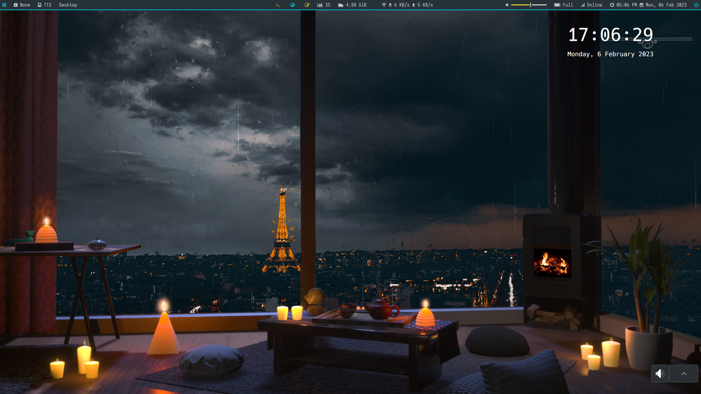

<!--toc:start-->

- [个人应用配置](#个人应用配置)
  - [先运行](#先运行)
  - [如果要使用本配置，执行下面代码，包含 ranger 的插件](#如果要使用本配置执行下面代码包含-ranger-的插件)
    - [也可以执行](#也可以执行)
  - [Clone 完成后](#clone-完成后)
  - [切换配置](#切换配置)
  - [Grub 主题](#grub-主题)
  - [Nvidia，自行选择是否安装。](#nvidia自行选择是否安装)
- [License](#license)
<!--toc:end-->

# 个人应用配置

除去 arch 安装脚本部分。
高度个性化，谨慎使用。

## 先运行

```bash
# 后跟 clash订阅链接，来连接github
$ ~/.linuxConfig/scripts/configClash.sh
```

## 如果要使用本配置，执行下面代码，包含 ranger 的插件

```bash
$ git clone --recursive https://github.com/saying121/.linuxConfig.git ~/.linuxConfig
```

### 也可以执行

```bash
$ git clone https://github.com/saying121/.linuxConfig.git ~/.linuxConfig
# 然后拉子自模块
$ git submodule update --init --recursive
```

## Clone 完成后

```bash
# 先自行配置代理,或者用./scripts/configClash.sh 脚本配置

# 正常用就运行，包含常用的软件
$ ~/.linuxConfig/install.sh clashlink

# kde+i3就运行
$ ~/.linuxConfig/i3/use-i3.sh

# 换回kwin运行
$ ~/.linuxConfig/i3/use-kwin.sh
# 切换配置有些问题，因为配置经常会变，默认为i3的配置，默认没有问题
```

## 切换配置

```bash
# 导入配置，在kde目录下的*.knsv文件
$ konsave -i *.knsv

# 列出配置选项
$ konsave -l

# 应用配置
$ konsave -a profile
```

## Grub 主题

`./xenlism-grub-4k-kali`从[ kde store ](https://store.kde.org/p/1440862)界面下载，自行选择是否安装。
wget 无法从浏览器下载链接下载文件，就放进了仓库。进入`./xenlism-grub-4k-kali`运行`./grub-theme.sh`来安装。

## Nvidia，自行选择是否安装，最好看 archwiki 。

```bash
# 安装后运行mkinitcpio
# nvidia/nvidia-open-dkms ,二选一
$ pacman -Qs nvidia
# local/cuda 11.8.0-1
#     NVIDIA's GPU programming toolkit
# local/cudnn 8.6.0.163-1
#     NVIDIA CUDA Deep Neural Network library
# local/egl-wayland 2:1.1.11-2
#     EGLStream-based Wayland external platform
# local/lib32-nvidia-utils 525.85.05-1
#     NVIDIA drivers utilities (32-bit)
# local/libvdpau 1.5-1
#     Nvidia VDPAU library
# local/nccl 2.15.5-1
#     Library for NVIDIA multi-GPU and multi-node collective communication primitives
# local/nvidia-open-dkms 525.85.05-1
#     NVIDIA open kernel modules
# local/nvidia-utils 525.85.05-1
#     NVIDIA drivers utilities
# local/opencl-nvidia 525.85.05-1
#     OpenCL implemention for NVIDIA
```

# License

[MIT](./LICENSE)
